# Online store

#### Видение проекта Online store:

Требуется создать **Интернет-магазин**. 

Приложение должно реализовывать **следующие функции**:

**1.Cо стороны клиента:**

- Просмотр категорий и товаров;

- Просмотр корзины и занесение товара в корзину;

- Осуществление заказа;

- Регистрация пользователя;

- Аутентификация пользователя;

- Кабинет пользователя;

- Валидация введенных данных.

**2.Cо стороны администратора:**

- Вход в Админпанель

- Просмотр списка категорий. Удаление, редактирование, добавление категории;

- Просмотр списка товаров. Удаление, редактирование, добавление товара;

- Просмотр списка заказов. Удаление, редактирование, фильтрация по дате заказа;

- Валидация введенных данных.
  
   
 <b>Быстрое руководство для просмотра основных функций сайта</b> 
 
  
 <b>Email и пароль для обычного пользователя:</b>  
    
    Email: user@epam.com;
    Пароль: 123456;
   
   
<b>Email и пароль для Администратора:</b> 
  
    Email: admin@epam.com;
    Пароль: 123456;
    
<b>1) Нажать на кнопку "Вход" в шапке сайта: </b>

    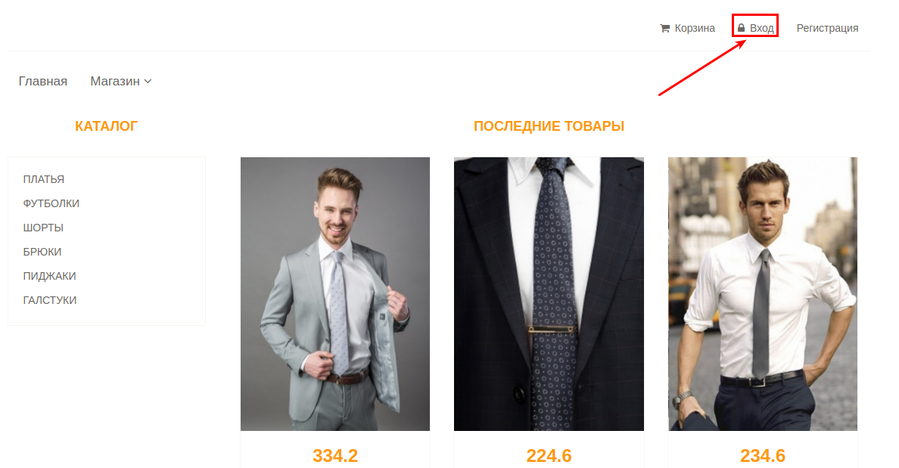

<b>2) Залогиниться в качестве Администратора( Email и пароль смотреть выше): </b>

    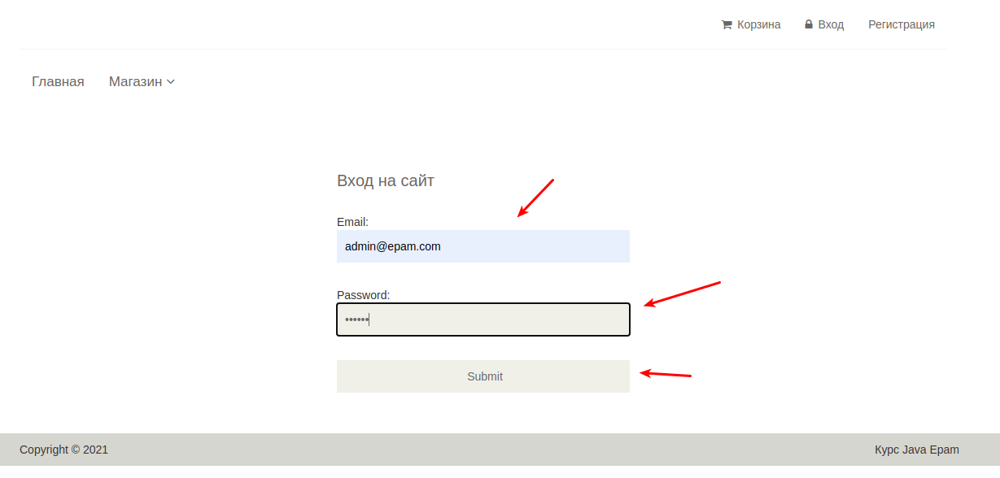

<b>3) Перейти в "Админпанель". Данная кнопка расположена в шапке сайта: </b>

    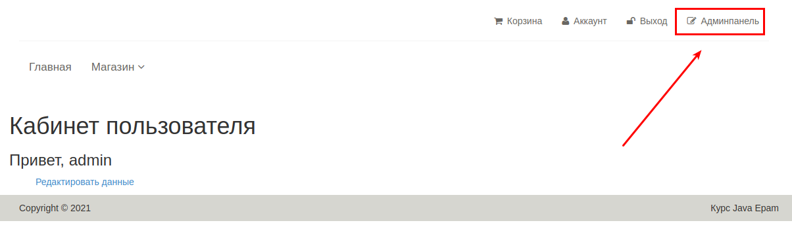

<b> 4) Две основные сущности в данном приложении это товары и заказы. Они соеденены связью Многие-ко-многим:</b>

    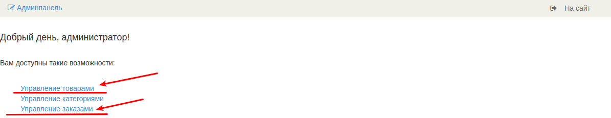

<b>5) Для того, чтобы просмотреть товары и заказы, достаточно нажать на соответствующие ссылки:"Управление товарами" и "Управление заказами";</b>  

  <b>6) После нажатия появятся следующие страницы:</b>

<b>"Управление товарами"</b>

    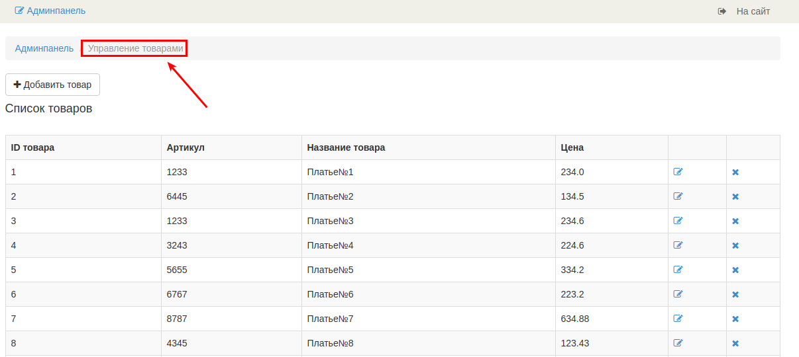

<b>"Управление заказами"</b>

    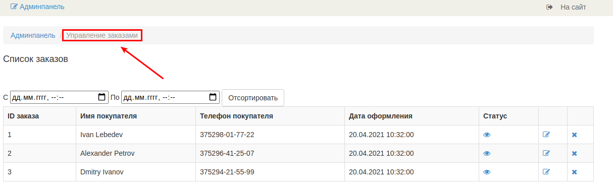

<b>7) Замечание:  более подробную информацию по страницам "Управление товарами" и "Управление заказами" смотреть в разделе "Функциональность сайта со стороны администратора";</b>

  
 <b>№1 Функциональность сайта со стороны клиента</b> 

#### 1. Просмотр категорий и товаров

   **1.1 Начальная страница.**  

**Основной сценарий:**

  - Пользователь переходит по адресу [http://localhost:8088](http://localhost:8088); пользователь нажимает вкладку "Главная";
  - Отображается список последних товаров, список категорий, меню( вкладки "Главная","Магазин"),а также верхняя шапка сайта( вкладки "Корзина, "Вход", "Регистрация");
  

    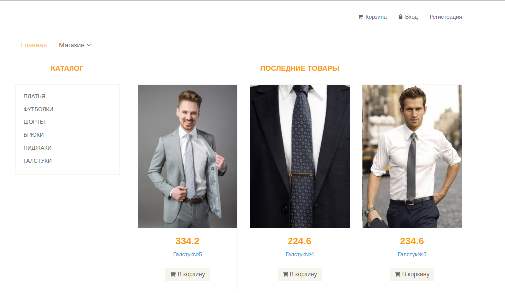
  

   **1.2 Станица категории.**  

**Основной сценарий:**

  - Пользователь нажимает конкретную категорию;
  - Отображается список последних товаров конкретной категории, список категорий, меню( вкладки "Главная","Магазин"),а также верхняя шапка сайта( вкладки "Корзина, "Вход", "Регистрация"); 
  - Перемещение по списку товаров категории осуществляется с помощью постраничной навигации.
  

    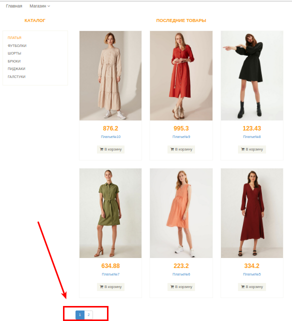
  

  
   **1.3 Станица продукта.**  

**Основной сценарий:**

  - Пользователь нажимает на конкретный товар;
  - Отображается подробная информация по продукту, список категорий, меню( вкладки "Главная","Магазин"),а также верхняя шапка сайта( вкладки "Корзина, "Вход", "Регистрация"); 
   

    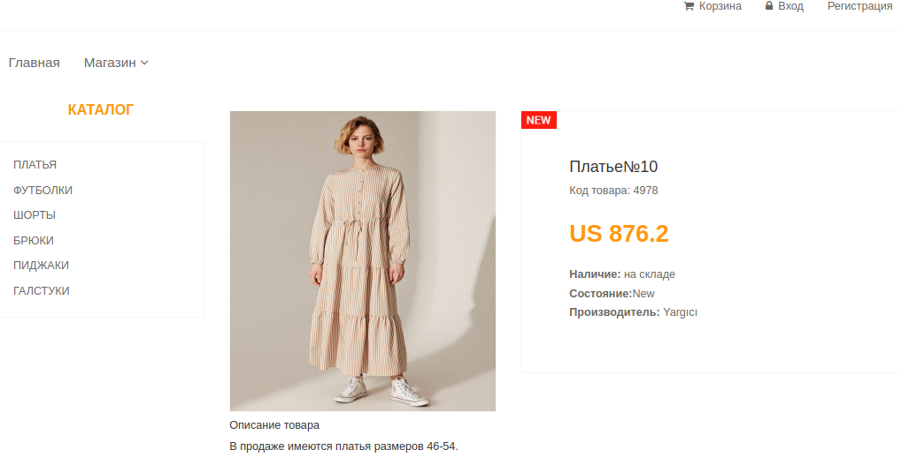
  

#### 2. Просмотр корзины и занесение товара в корзину

   **2.1 Занесение товара в корзину**  

**Основной сценарий:**

  - Пользователь нажимает на кнопку "В корзину" рядом с товаром;
  - В шапке сайта рядом с пунктом корзина отображается цифра, говорящая о количестве товара, добавленного в корзину; также отображается список последних товаров, список категорий, меню( вкладки "Главная","Магазин"),а также верхняя шапка сайта( вкладки "Корзина, "Вход", "Регистрация");
  

    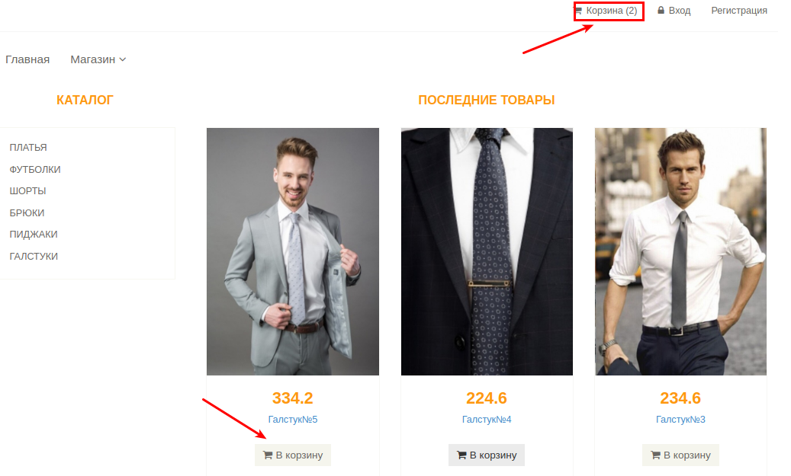
  

  
  **2.2 Просмотр корзины**  

**Основной сценарий:**

  - Пользователь нажимает на вкладку "Корзина" в шапке профиля;
  - Отображается подробная информация по заказу(подробности о каждом товаре, количество товара, общая стоимость, кнопка "Оформить заказ"); также отображается список категорий, меню( вкладки "Главная","Магазин"),а также верхняя шапка сайта( вкладки "Корзина, "Вход", "Регистрация");
  

    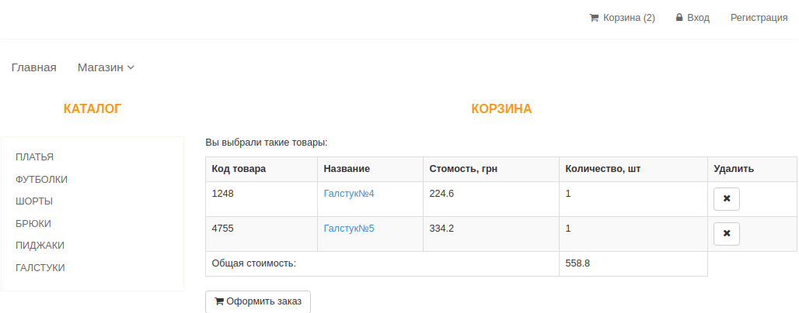
  

  
#### 3. Осуществление заказа;

   **3.1 Заполнение заказа**  

**Основной сценарий:**

  - Пользователь нажимает на кнопку "Оформить заказ" в корзине;
  - Отображается форма для оформления заказа("Имя","Телефон","Комментарий"),количество заказанных товаров, общая стоимость; также отображается список категорий, меню( вкладки "Главная","Магазин"),а также верхняя шапка сайта( вкладки "Корзина, "Вход", "Регистрация");
  - Если пользователь залогинен, то имя уже введено;
  - По всем полям, кроме поля "Комментарий к заказу" проводится валидация; 
  - Если данные введены верно, то появляется сообщение "Заказ оформлен! Мы вам перезвоним!"
  

    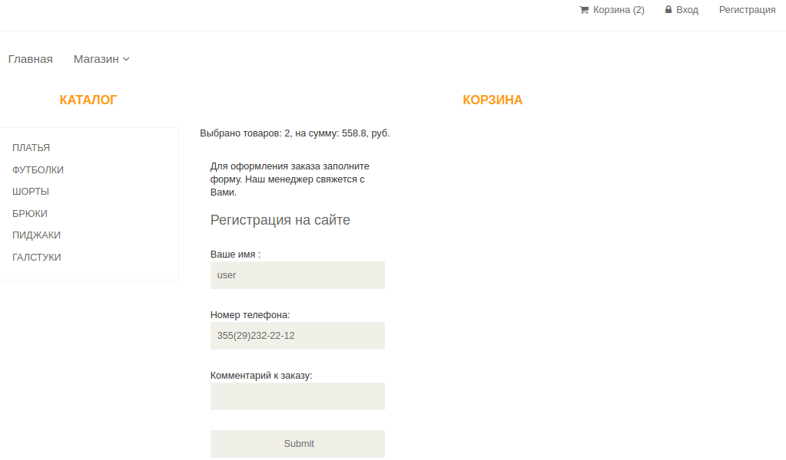
  

  
#### 4. Регистрация пользователя;

   **4.1 Регистрация**  

**Основной сценарий:**

  - Пользователь нажимает на кнопку "Регистрация" в шапке сайта;
  - Отображается форма для регистрации("Имя","Email","Пароль");также отображается  меню( вкладки "Главная","Магазин") и шапка сайта( вкладки "Корзина, "Вход", "Регистрация");
  - Пользователь заполняет поля и регистрируется;
  - Если данные введены верно, то появляется сообщение "Вы успешно зарегистрированны!"
  - По всем полям, проводится валидация. Пользователь не может ввести уже зарегистрированный email; 
  

    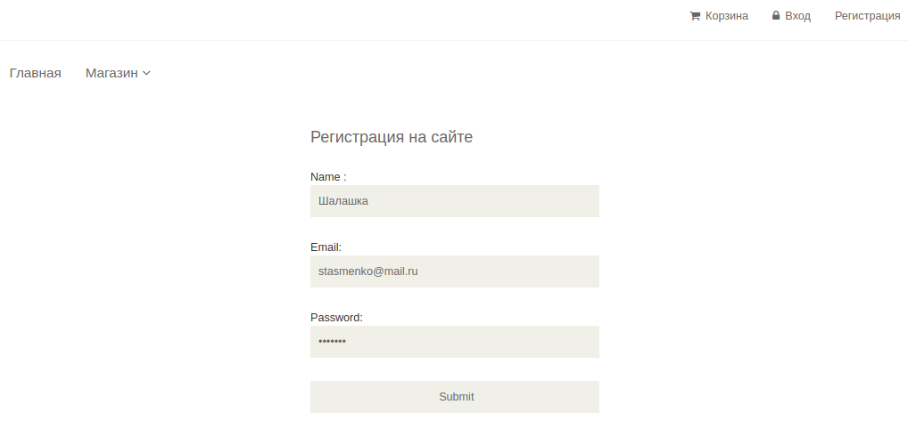
  

  
#### 5. Аутентификация пользователя;

**5.1 Аутентификация**  

**Основной сценарий:**

  - Пользователь нажимает на кнопку "Вход" в шапке сайта;
  - Отображается форма для аутентификации("Email","Пароль");также отображается  меню( вкладки "Главная","Магазин") и шапка сайта( вкладки "Корзина, "Вход", "Регистрация");
  - Пользователь заполняет поля и отправляет данные;
  - Если данные введены верно, то пользователь перенаправляется в свой кабинет;
  - По всем полям, проводится валидация.
  

    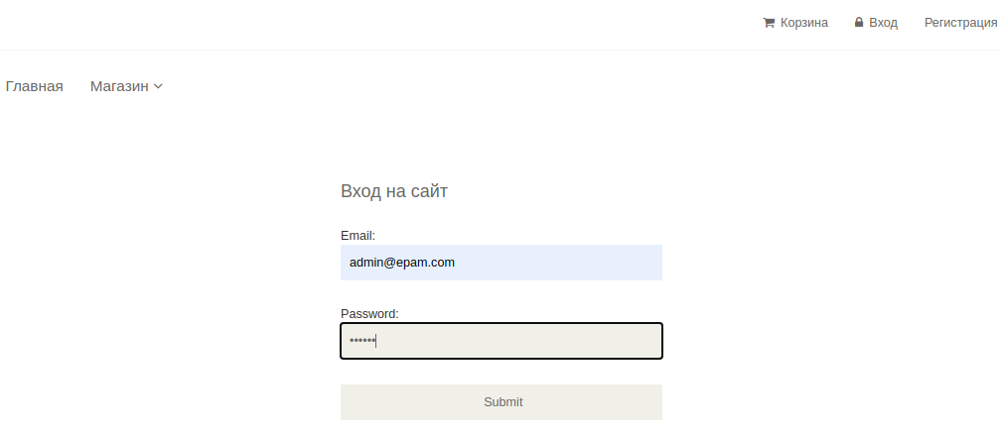
  

  
#### 6. Кабинет пользователя;
  
  **6.1 Вход в кабинет**  

**Основной сценарий:**

  - В случае, если пользователь аутентифицирован, в шапке профиля появляется ссылка "Аккаунт"; 
  - Пользователь нажимает на ссылку "Аккаунт в шапке профиля и попадает в личный кабинет;
  - Отображается ссылка "Редактировать данные";также отображается  меню( вкладки "Главная","Магазин") и шапка сайта( вкладки "Корзина, "Аккаунт", "Выход"," Админпанель");
  

    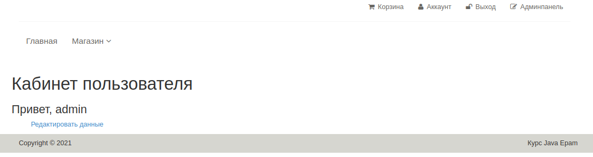
  

 **6.2 Разлогирование пользователя**  

**Основной сценарий:**

  - Если аутентифицированый пользователь хочет разлогиниться, в шапке профиля он должен нажать на кнопку "Выход";  
  - Пользователь перенаправляется на основную страницу сайта;
  

    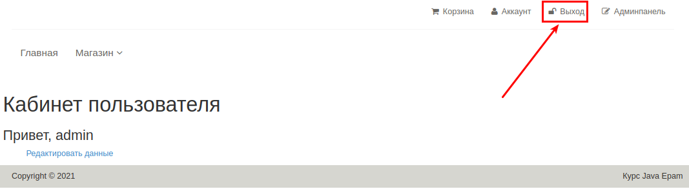
  

  
   **6.3 Редактирование данных пользователя**  

**Основной сценарий:**

  - В случае, если пользователь аутентифицирован и хочет изменить свои данные, то в своем кабинете он наживает "Редактировать данные"; 
  - Отображается форма для редактирования данных ("Новое имя","Новый пароль");также отображается  меню( вкладки "Главная","Магазин") и шапка сайта( вкладки "Корзина, "Аккаунт", "Выход"," Админпанель");
  - Пользователь заполняет поля и отправляет данные;
  - Если данные введены верно, то появляется сообщение об успешном изменении данных;
  - По всем полям, проводится валидация.

    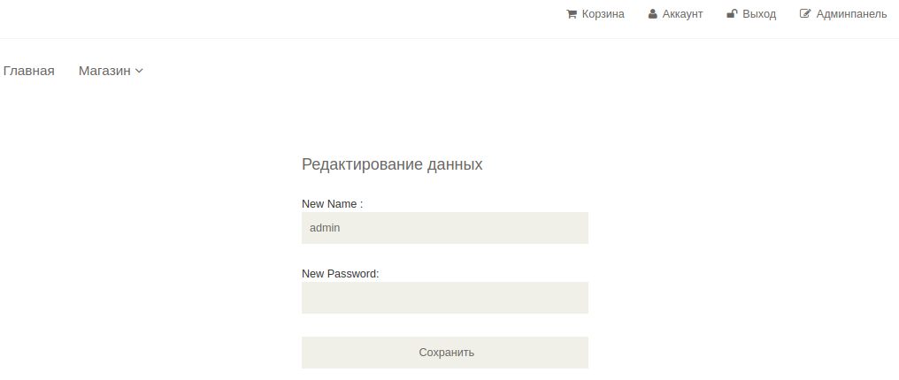
  
  
  
   
 <b>№2 Функциональность сайта со стороны администратора</b> 

  
#### 1. Вход в Админпанель;
  
  **1.1 Вход в кабинет администратора**  

**Основной сценарий:**

  - В случае, если пользователь аутентифицирован, в шапке профиля появляется ссылка "Админпанель"; 
  - Пользователь нажимает на ссылку "Админпанель" в шапке профиля и попадает в личный кабинет Администратора;
  - В кабинете отображаются ссылки "Управление товарами","Управление категориями","Управление заказами";также отображается шапка сайта("На сайт"," Админпанель");
  - Если пользователь не авторизирован под ролью Администратора, а авторизирован под ролью пользователя, то при нажатии  на кнопку "Админпанель" выводится  сообщение об ограничении доступа
  

    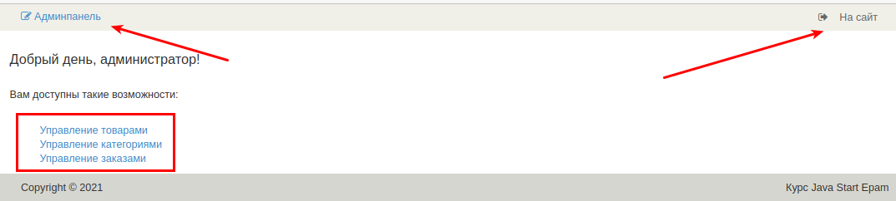
  

#### 2. Работа с категориями;
  
  **2.1 Просмотр списка категорий**  

**Основной сценарий:**

  - Администратор нажимает на ссылку "Управление категориями" в личном кабинете Администратора;
  - На странице управления категориями выводится список категорий с подробной информацией по каждой, кнопки "Добавить","Удалить","Редактировать";также отображается шапка сайта("На сайт"," Админпанель") и навигация по кабинету Администратора;
  

    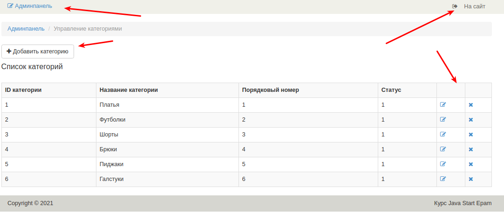
  

  
   **2.2 Удаление категории**  

**Основной сценарий:**

  - На странице управления категориями Администратор нажимает по кнопке "Удалить категорию".
  - Появляется диалоговое окно для подтвержения удаления категории.
  - В случает ответа "Нет" Администратор возвращается к списку категорий.
  - При положительном ответе, если товар из данной категории есть в заказе, выводится сообщение о невозможности удаления, иначе - происходит удаление категории.
  - При удалении категории происходит удаление всего товара, принадлежащего ей.
  

    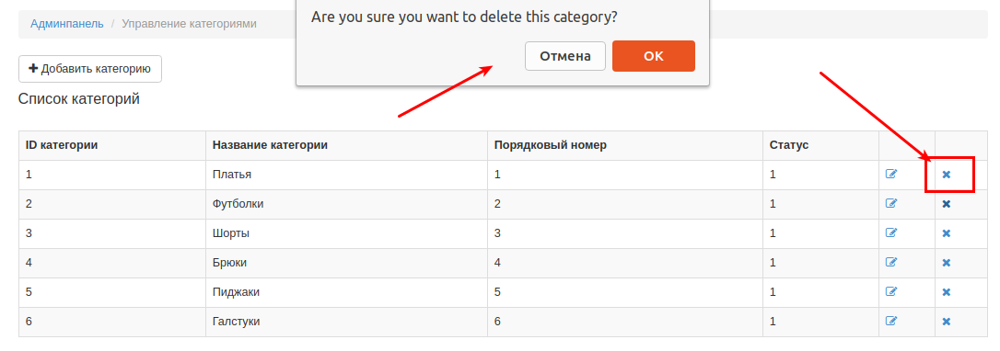
  

  
  **2.3 Редактирование категории**  

**Основной сценарий:**

  - На странице управления категориями Администратор нажимает по кнопке "Редактировать категорию".
  - Отображается режим редактирования текущей категории.
  - Аминистратор редактирует категорию( "Название","Порядковый номер","Статус");
  - В случае отмены редактирования, Администратор нажимает на ссылку "Управление категориями" на панели навигации;
  - При нажатии сохранить - категория сохраняется, а также происходит перенаправление на страницу со списком категорий;
  - При отправке изменений все данные валидируются, и в случае ошибки выдается сообщение;
  

    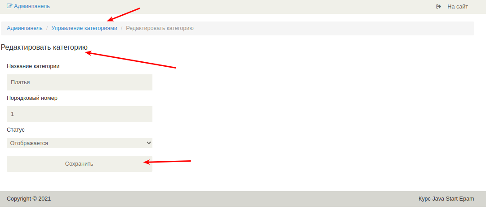
  

  
  **2.4 Добавление категории**  

**Основной сценарий:**

  - На странице управления категориями Администратор нажимает по кнопке "Добавить категорию";
  - Отображается режим добавления новой категории.
  - Аминистратор вводит данные( "Название","Порядковый номер","Статус");
  - В случае отмены добавления Администратор нажимает на ссылку "Управление категориями" на панели навигации;
  - При нажатии сохранить - категория сохраняется, а также происходит перенаправление на страницу со списком категорий;
  - При сохранении категории все данные валидируются и в случае ошибки выдается сообщение;
  

    
  

  
  
#### 3. Работа с товаром;
  
  **3.1 Просмотр списка товаров**  

**Основной сценарий:**

  - Администратор нажимает на ссылку "Управление товарами" в личном кабинете Администратора;
  - На странице управления товаром выводится список товаров с подробной информацией по каждой, кнопки "Добавить","Удалить","Редактировать";также отображается шапка сайта("На сайт"," Админпанель") и навигация по кабинету Администратора;
  

    
  

  
   **3.2 Удаление товара**  

**Основной сценарий:**

  - На странице управления товарами Администратор нажимает по кнопке "Удалить товар".
  - Появляется диалоговое окно для подтвержения удаления товара.
  - В случает ответа "Нет" Администратор возвращается к списку товаров.
  - При положительном ответе, если данный товар  есть в заказе, выводится сообщение о невозможности удаления, иначе - происходит удаление товара.
  - После удаления товара Администратор возвращается к списку товаров.
  

    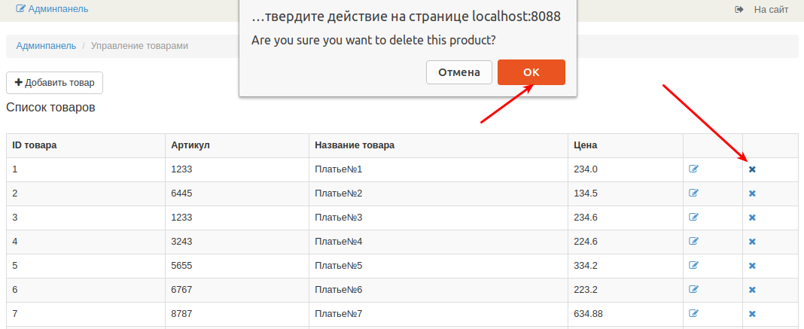
  

  
  **3.3 Редактирование товара**  

**Основной сценарий:**

  - На странице управления товарами Администратор нажимает по кнопке "Редактировать товар".
  - Отображается режим редактирования текущего товара.
  - Аминистратор редактирует товар( "Название","Артикул","Стоимость" и т.д.);
  - В случае отмены редактирования Администратор нажимает на ссылку "Управление товарами" на панели навигации;
  - При нажатии сохранить - товар сохраняется, а также происходит перенаправление на страницу со списком товаров;
  - При отправке изменений все данные валидируются и в случае ошибки выдается сообщение;
  

    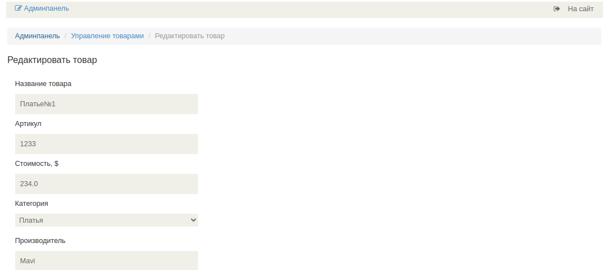
  

  
  **3.4 Добавление товара**  

**Основной сценарий:**

  - На странице управления товарами Администратор нажимает по кнопке "Добавить товар".
  - Отображается режим добавления нового товара.
  - Аминистратор вводит данные( "Название","Артикул","Стоимость" и т.д.);
  - В случае отмены добавления Администратор нажимает на ссылку "Управление товарами" на панели навигации;товар сохраняется, а также происходит перенаправление на страницу со списком товаров;
  - При сохранении товара все данные валидируются и в случае ошибки выдается сообщение;
  

    
  

  
#### 4. Работа с заказами;
  
  **4.1 Просмотр списка заказов**  

**Основной сценарий:**

  - Администратор нажимает на ссылку "Управление заказами" в личном кабинете Администратора;
  - На странице управления заказами выводится список заказов с подробной информацией по каждой, кнопки "Удалить","Редактировать","Отсортировать по дате"," Просмотреть", поля для выбора даты;также отображается шапка сайта("На сайт"," Админпанель") и навигация по кабинету Администратора;
  

    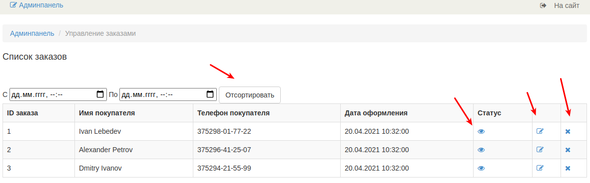
  

  
  **4.2 Сортировка заказов по дате**  

**Основной сценарий:**
  - Администратор нажимает на кнопку "Управление заказами" в личном кабинете Администратора;
  - Выбирает дату, по которой будет произвоиться сортировка;
  - Администратор нажимает на кнопку "Отсортировать";
  - На странице управления заказами выводится список заказов по определенной дате с подробной информацией по каждой, кнопки "Удалить","Редактировать","Отсортировать по дате"," Просмотреть", поля для выбора даты;также отображается шапка сайта("На сайт"," Админпанель") и навигация по кабинету Администратора;
  - Пользователь может  не выбирать начальную дату. В данном случае будет производиться сортировка до конечной даты; Аналогично пользователь может не выбирать конечную дату;
  - Если начальная дата превышает конечную, будет выдано соответствующее сообщение;
     

    
  

  
   **4.3 Удаление заказа**  

**Основной сценарий:**

  - На странице управления заказами Администратор нажимает по кнопке "Удалить заказ".
  - Появляется диалоговое окно для подтвержения удаления заказа.
  - В случает ответа "Нет" Администратор возвращается к списку заказов.
  - При положительном ответе происходит удаление заказа.
  - После удаления заказа Администратор возвращается к списку заказов.
  

    
  

  
  **4.4 Редактирование заказа**  

**Основной сценарий:**

  - На странице управления заказами Администратор нажимает по кнопке "Редактировать заказ".
  - Отображается режим редактирования текущего заказа.
  - Аминистратор редактирует заказ( "Имя клиента","Телефон клиента" и т.д.);
  - В случае отмены редактирования Администратор нажимает на ссылку "Управление заказами" на панели навигации;
  - При нажатии сохранить - заказ сохраняется, а также происходит перенаправление на страницу со списком заказов;
  - При отправке изменений все данные валидируются и в случае ошибки выдается сообщение;
  

    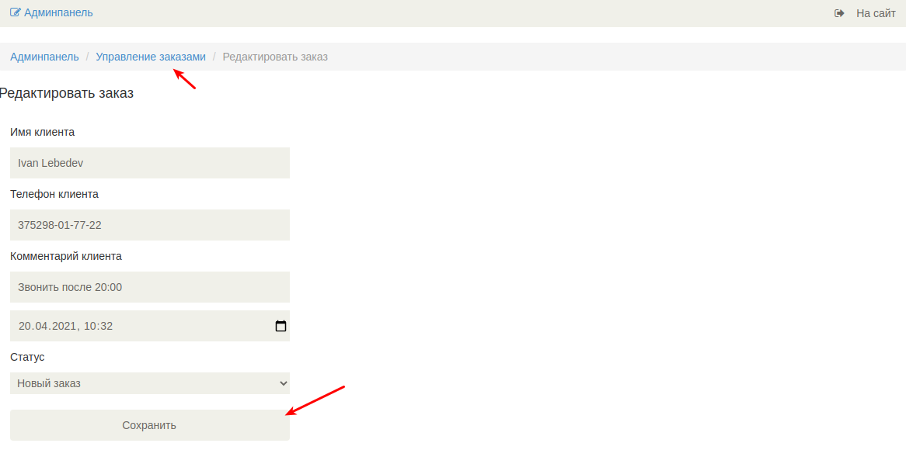
  

  
  **4.5 Просмотр заказа**  

**Основной сценарий:**

  - На странице управления заказами Администратор нажимает по кнопке "Просмотр заказа";
  - Отображается режим просмотра текущего заказа( номер заказа, имя клиента, телефон клиента, комментарий). Также выводится список товаров, входящих в заказ.  Общая стоимость заказа, отображаемая на данной странице, есть результат агрегативной функции;
  - Чтобы вернуться к списку заказов Администратор нажимает на ссылку "Управление заказами" на панели навигации;
  

    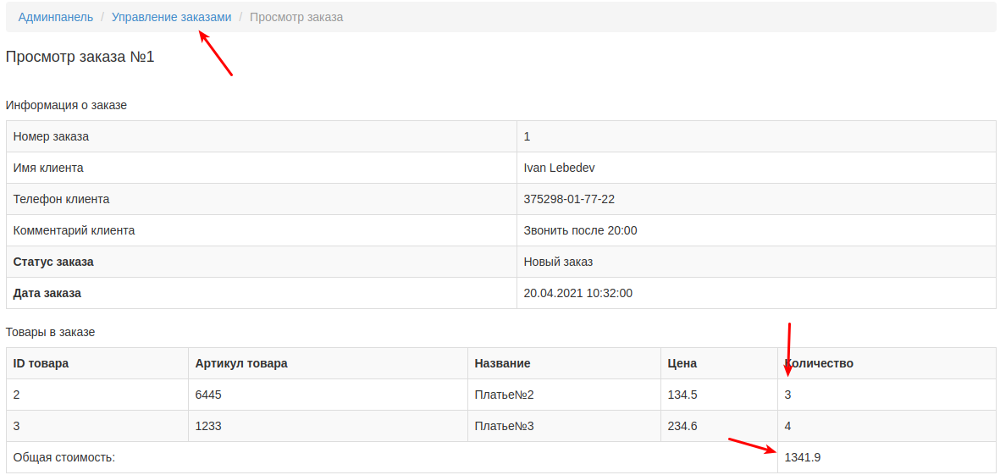
  

